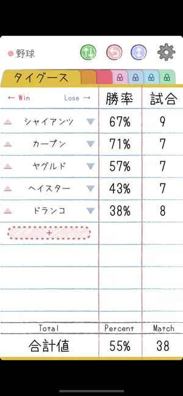
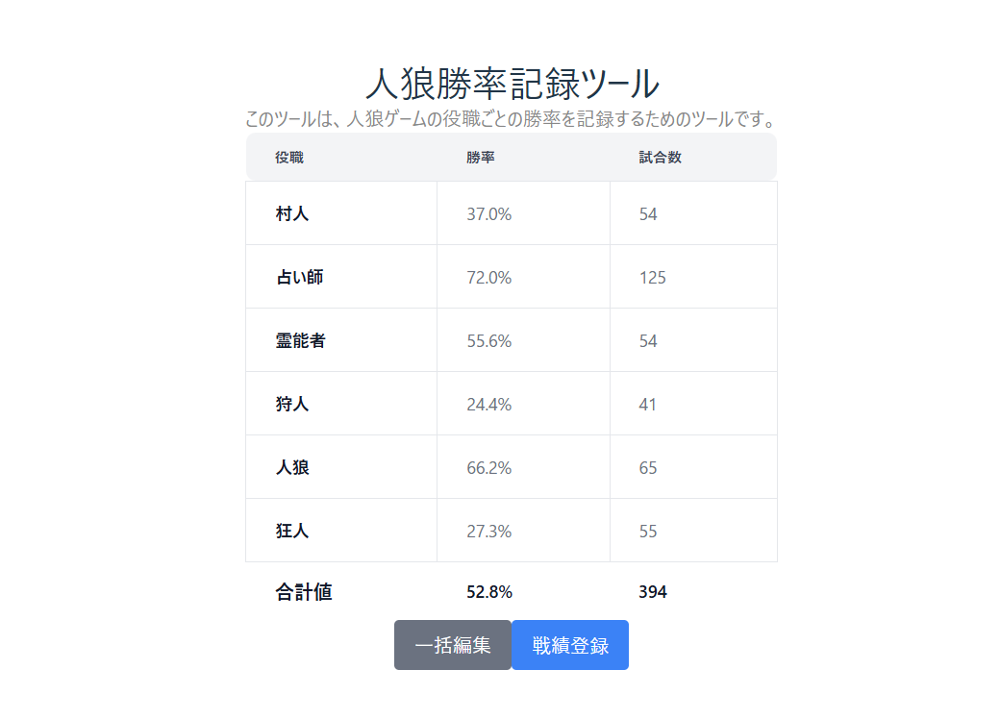

人狼ジャッジメントというスマホゲームがある。ゲーム内データとして勝率というものがあるのだが、全てのゲームにおける勝率しかわからない。

私はこれについて 2 点不満があった。

1 つは私は基本的に 9 人スタンダードと呼ばれる配役の部屋に参加するため、この配役の役職ごとの勝率が見たいということ。

もう 1 つは残念なことにゲーム内に荒らしや会話せず突然死というシステム上の処理が行われた試合でさえも勝率としてカウントされることである。

自分がまともにゲームをプレイしていないのに勝率に加えられるのはいかがなものか？と思っていた。

そこで、自分で勝率を記録しておくのが良い。実際 X 上でも「[勝率記録ノート](https://apps.apple.com/jp/app/%E5%8B%9D%E7%8E%87%E8%A8%98%E9%8C%B2%E3%83%8E%E3%83%BC%E3%83%88/id1035299957)」と呼ばれる簡易的に勝敗数を記録できるアプリがある。

しかしこのアプリは iOS 限定なのだ。iPad で使ったことがあるのでいいアプリではあるのだが、できれば人狼ゲームをプレイするスマホ上で管理できると良い。そこで、Vercel と (Vite と) React の勉強がてら自分で作ることにした。

作ったサイトはこちらである。

https://win-rate-tracker.vercel.app/

以下はイメージ図。流石にこんなに村人で負けてないし人狼で勝ってない。

レスポンシブデザインなどクソくらえなので自分のスマホ端末で最もいい感じになるようにしかしていない。しかも役職は固定だし戦歴が時系列で見れるわけでもない。おまけに localStorage を使った簡素なものなので Safari ブラウザでは 1 週間しかデータ保管がされず使い物にならないときた。

Android スマホを使っていて、基本的に 9 スタ村しかせず、iOS 勢の勝率記録ノートを羨ましく思っている稀有な人は使ってみてほしい。以上だ。
